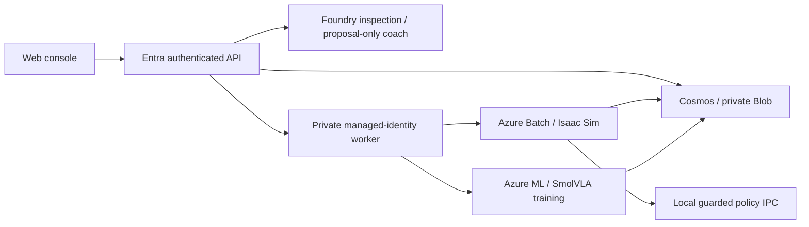

# Azure Physical AI

**실제 장비 없이 Azure의 Isaac Sim에서 시각 검사·부품 분류·정책 학습을 설명하고
실행하는 고객 데모/워크샵 에셋입니다.** Foundry는 검사·학습 제안을 담당하고,
SmolVLA는 영상과 관절 상태에서 action을 예측합니다. 실제 PhysX·카메라·관절 guard와
원본 증거를 사용하며 브라우저 애니메이션이나 replay를 학습 성공으로 대신하지 않습니다.

**현재 상태 — 2026-10-03: 개발·운영 중인 reference solution이며 고객용 learned-policy
release는 차단 상태입니다.** 기준 제어기의 물리 작업과 실제 P0 학습은 확인했지만,
학습 정책의 독립 물리 품질 기준은 아직 통과하지 못했습니다. 최근 P0 재학습은
`Failed`로 종료됐고 step-100/200 full-state checkpoint를 검증·보존했습니다.
학습·API 반입·CI 성공은 로봇 작업 성공이나 고객 실행 승인과 다릅니다.

| 목적 | 시작 문서 |
|---|---|
| 어떤 기능이 있고 무엇이 남았는가 | [현재 상태와 다음 작업](docs/status.md) |
| 고객에게 시나리오와 코드 작성 방법 설명 | [고객 워크샵·의사코드](docs/customer-workshop.md) |
| 운영·실패 복구·중단·증거 보존 | [운영 런북](docs/operator-runbook.md) |
| 개발 환경·테스트·저장소 구조 | [기여·개발 가이드](CONTRIBUTING.md), [코드 구조](docs/repository-map.md) |
| Azure 준비·배포 | [배포 가이드](docs/azure-deployment.md), [managed simulation](docs/managed-simulation.md) |
| 전체 문서 찾기 | [문서 인덱스](docs/README.md) |

## Architecture and scope



현재 학습용 제어는 **NON_REALTIME_SIMULATION**입니다.
Paused simulation은 추론 중 물리를 멈추고 승인된 action마다 60 Hz의 실제 physics tick
6개를 진행합니다. 실물 장비의 제어 주기를 충족했다는 뜻이 아닙니다.
ROS 2·MQTT·OPC UA·MCP는 향후 연결 가이드의 선택 확장이며 현재 필수 설치 항목이 아닙니다.
실제 장비 driver·현장 안전 인증·상시 GPU 가용성은 이번 에셋에 포함하지 않습니다.

public viewer는 승인된 synthetic presentation의 읽기 전용 화면입니다.
`/operator/`는 Entra 인증과 tenant/owner scope를 유지합니다. 방문자가 Foundry 호출,
유료 실행 또는 로봇 동작을 자동 승인하지 않습니다. 배포 URL을 열기만 해도 시뮬레이터가
시작되는 one-click 서비스가 아닙니다.

## Local quick start: CPU checks only

저장소 root에서 **Ubuntu WSL/Linux**로 실행합니다. Windows Python/Node 환경과
Isaac Python, native policy Python은 혼용하지 않습니다.

```bash
bash scripts/setup-dev.sh
source scripts/dev-env.sh
uv run --locked python -m contracts.validate_environment examples/inspection-cell.json --json
bash scripts/check.sh
```

이 검사는 Azure login·GPU·MCP 없이 실행하는 개발 검증입니다. 의존성 설치에는
package registry 접근이 필요합니다. 실제 Azure 배포·GPU 학습은 별도 준비·승인·deadline과
[런북](docs/operator-runbook.md)이 필요합니다. 설정 validator의 `runtime_verified: false`
출력은 의도된 결과입니다.

## Repository boundaries

`apps/`는 웹/API/worker, `agents/`는 Foundry, `simulation/`은 Isaac·managed task,
`learning/`은 데이터·모델·학습·평가, `contracts/`는 고객 설정, `infra/`는 IaC,
`scripts/`는 개발/운영 entrypoint입니다. 상세 경로와 수정 시 주의사항은
[코드 구조](docs/repository-map.md)에 있습니다.

모델·dataset·checkpoint는 private Blob의 scope에 귀속되며 Git에 넣지 않습니다.
이 저장소는 weights 다운로드 상품이나 고객 소유권 이전 도구가 아닙니다.
실제 checkpoint와 실패 이력은 [현재 상태](docs/status.md), 긴 기술 이력은
[구현 이력](docs/implementation-history.md)에서 구분해 확인합니다.
