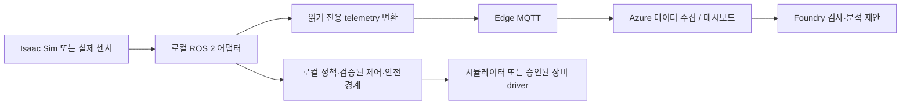

# 고객 워크샵: 학습된 정책과 실제 Isaac Sim 증거 확인

**상태 기준: 2026-10-02. 현재는 워크샵 준비 자료이며, 학습 정책을 고객 실행용으로 승인했다는 뜻이 아닙니다.** 실제 P0 학습과 비공개 앱 반입은 완료했지만, 학습 정책의 물리 검증은 아직 불완전합니다. 아래 참가자 실습은 **그 고객의 실행 주체에 귀속되고, 사전에 물리 품질까지 검증된 버전 고정 체크포인트**가 있을 때만 진행합니다. 지금의 미완료 상태를 reference controller, 녹화 영상, replay 또는 브라우저 애니메이션으로 대체하여 “학습 성공”으로 설명하지 않습니다.

이 문서는 기존 저장소의 운영 경로를 연결합니다. 모델 다운로드 상품, 자격 증명, 고객별 완성 배포 설정 또는 새 자동화 도구를 제공하지 않습니다. 새로운 학습/평가 결과가 나오면 원본 증거를 확인한 운영자가 아래 상태를 갱신해야 합니다.

## 고객이 이해할 시나리오: 시뮬레이션에서 배우고, 현장 장비로 확장

**고객 질문은 “부품을 보고 지정 트레이로 옮기는 작업을 Azure에서 학습하고,
검증한 뒤 현장 장비에 연결할 수 있는가?”입니다.** 첫 단계는 장비 없이 Isaac Sim에서
관찰·시연·학습·원본 물리 평가를 확인하는 과정입니다. 이후 현장 카메라와 장비 상태를
읽기 전용으로 연결하고, 마지막에 해당 실물 로봇의 안전 검증을 별도로 통과한 경우에만
실물 작업을 다룹니다. 시뮬레이션 성공을 실물 성공으로 자동 승격하지 않습니다.

| 단계 | 고객이 보는 장면 | 준비 또는 통과 기준 |
|---|---|---|
| 1. 장비 없는 Physical AI | 가상 카메라 영상과 관절 상태를 보고 학습 정책이 부품을 옮김; 원본 성공·실패 증거 비교 | 실제 학습 체크포인트와 독립된 물리 품질 평가. 현재 고객 실행 승인 전 |
| 2. ROS 2 연동 실습 | Isaac Sim의 카메라·joint state·clock을 ROS 2에서 구독해 같은 작업의 장비 인터페이스를 설명 | 버전 고정 ROS 2 bridge, 좌표계·관절 이름·단위·시각·QoS 검증. 현재 미구현 확장 |
| 3. 현장 IoT 관찰 | 실제 카메라/센서/장비 상태가 대시보드에 표시되고 Foundry가 검사·원인 검토를 제안 | 읽기 전용 edge 어댑터, 장비 연결 승인, 인증·토픽 권한·데이터 출처. 로봇 구동 없음 |
| 4. 실물 작업 | 같은 업무 목적을 실물 로봇으로 수행하고 성공·오류·안전 정지를 관찰 | 로봇별 driver·보정·정책 재검증·독립 안전 시스템·현장 승인. 현재 지원/인증 주장 없음 |

**ROS 2는 로봇 소프트웨어 연결 계층이고, IoT는 현장 데이터 연결 계층입니다.**
둘은 대체 관계가 아닙니다. Isaac Sim의 ROS 2 bridge는 영상·상태·시뮬레이션 시각을
ROS 애플리케이션에 연결하는 공식 경로입니다. 현재 정책 실행은 자체 검증 IPC와
paused physics 경로이므로, bridge가 이미 구현되어 있다고 안내하지 않습니다.
특히 paused simulation은 실물 로봇의 시각과 동작을 멈추는 방법이 아닙니다.
현재 모델의 실물 제어 주기 적합성은 별도로 검증해야 합니다.



그림은 **향후 통합 설계**이며 현재 배포 구조의 증명이 아닙니다. Foundry에서
motor/joint 명령으로 직접 이어지는 경로를 제공하지 않습니다. 초기 ROS→MQTT
어댑터는 카메라 메타데이터, episode ID, 성공/실패/unknown, 장비 상태 등 명시적으로
허용한 telemetry만 내보내고 제어 토픽을 구독하지 않는 것이 기본입니다.
실물의 비상 정지와 안전 한도는 ROS나 클라우드 연결만으로 대체하지 않습니다.

간단한 단일 장비 데모에는 고객 장비가 지원하는 MQTT와 명시적인 수집 경로부터
시작할 수 있습니다. **Azure IoT Operations는 클라우드 로봇 제어기가 아니라,
Azure Arc-enabled Kubernetes에서 실행되는 edge 데이터 플랫폼**입니다.
여러 산업 장비·OPC UA·edge MQTT·데이터 흐름 관리가 필요할 때 선택합니다.
처음부터 Kubernetes를 필수로 추가해 참가자 준비를 어렵게 만들지 않습니다.
ROS→MQTT 변환은 별도 어댑터가 필요하며, IoT Operations가 ROS 2를 자동 연결한다고
설명하지 않습니다.

하드웨어가 정해지기 전에는 driver나 실물 실행 명령을 선택하지 않습니다.
같은 Franka 시뮬레이션이라도 실제 장비의 camera calibration, joint order,
gripper, workspace, latency, payload, collision model, safety interface가 다르면
현재 체크포인트를 그대로 실행할 근거가 없습니다.

공식 참고 자료:
[Isaac Sim ROS 2 bridge](https://docs.isaacsim.omniverse.nvidia.com/latest/ros2_tutorials/index.html),
[Azure IoT Operations 개요](https://learn.microsoft.com/en-us/azure/iot-operations/overview-iot-operations).
NVIDIA의 최신 ROS 문서는 Humble/Jazzy를 권장하지만, 이 저장소의 고정 Isaac
이미지와 Python/ROS 호환성을 따로 확인하고 고정합니다. 최신 문서의 권고를 이유로
기존 이미지·제어 fingerprint를 몰래 업그레이드하지 않습니다.

## 1. 현재 준비 상태와 시연 범위

| 항목 | 확인된 사실 | 고객 실습에 대한 의미 |
|---|---|---|
| 실제 reference 물리 작업 | 별도 managed Isaac 실행에서 grasp/lift/transport/place/release의 측정된 통합 성공이 있음 | 스크립트 기반 기준 제어기의 성공이며, 학습 정책의 성공률이 아님 |
| P0 TRAIN 및 학습 | 20개의 reference-controller TRAIN episode, 8,587 frame; 실제 A100 80 GB 한 장에서 1,000 optimizer update 완료, 가중치 변경 확인 | 실제 학습된 모델은 존재함. 사람 시연이나 물리 품질 통과로 재분류하지 않음 |
| 체크포인트와 앱 반입 | 완전한 체크포인트 10회 발행, step-600 full-state 복원/해시 확인; 원래 native provenance를 검증한 private external import 완료 | 새 API `TrainingRun`이나 release가 생긴 것이 아님 |
| P0 learned validation | finger joint 2의 제안 값이 guard에 거부되어 action 적용 전에 중단 | **불완전/unscorable**. clipping한 실행, 성공 episode 또는 최종 품질 점수로 계산하지 않음 |
| P1 추가 TRAIN | 11001–11007의 7개 원본 시연 검증 완료. 11005의 원래 CUDA/EGL 실패는 보존하고, GPU 재검증 뒤 별도 승인한 1회 재시도만 성공. 11008–11020은 미시도 | 기준 제어기 시연이며 learned 성공이 아님. 추가 20개 완료 아님. P1 학습 모델 없음 |
| P0/P1 비교 및 release | 완전한 40-trial held-out 품질 통과와 learned-policy release 없음 | 고객 learned 실행 단계 **차단** |
| 운영 복구 | 10월 1일은 유료 할당 전 중단. 비용 상한 해제 후 10월 2일 복구에서 7개 시연(3,015 frame·6,044 file)과 모델·체크포인트·변환 데이터를 검증·보존하고 해당 작업/GPU 종료 확인 | 별도 A100 감사는 모델 호출 전 staging 검사에서 중단. 실제 예측·새 학습·품질 통과 증거로 해석하지 않음 |

실습 대상은 검토된 Franka 기반 셀, 지정 task/profile/criteria, 지정 부품·카메라·관절 순서의 시뮬레이션입니다. 새 공장, 실제 산업용 로봇, 다른 그리퍼·물성·카메라에 대한 검증이나 안전 인증이 아닙니다. 100% 정확도, GPU 확보 시간, 추론 지연, 운영 가용성, 생산성 또는 ROI를 보증하지 않습니다.

| 구성 요소 | 실제 역할 | 하지 않는 일 |
|---|---|---|
| Foundry inspector / learning coach | 검사 경로의 이미지 기반 제안 / 데이터·평가에 대한 typed `proposal_only` 조언 | coach 응답만으로 학습 제출, 로봇 action, 안전 한도 변경, 결제 또는 release 승인 |
| SmolVLA | 검증된 원본 모델로 상태·영상에서 Franka action 예측 | Foundry 대화 모델의 텍스트를 임의 로봇 명령으로 변환 |
| Isaac Sim + 제어 guard | Azure GPU에서 실제 렌더링·물리 실행, 독립된 action/joint/speed/force/deadline 검사와 증거 생성 | 화면 애니메이션, clipping을 통한 실패 은폐, 실물 로봇 인증 |
| 웹 콘솔 / private API | Entra 인증, 환경 초안·revision, 실제 record·plan·오류·증거 조회 | 가중치만 있으면 다른 소유자의 모델을 실행하는 범용 launcher |

`LIVE`는 실제 현재 실행의 출처이지 “실시간 10 Hz 통과”를 뜻하지 않습니다. Paused 경로는 **NON_REALTIME_SIMULATION**으로 설명합니다. v1은 30 SIM초/1,800 tick/300 frame, 명시적 v2는 60 SIM초/3,600 tick/600 frame이며 episode의 최대 600 WALL초와 독립 안전 한도는 그대로입니다. 이전 실시간 100 ms/80 ms gate 실패도 삭제하거나 paused 성공으로 덮지 않습니다.

## 2. 실행 주체와 참가자가 할 수 있는 일

프로젝트·dataset·model manifest·candidate는 **tenant와 opaque owner**에 귀속됩니다. 같은 Entra tenant의 다른 사용자도 같은 owner가 아닙니다. 기존 external-native import는 원래 같은 scope의 승인·작업·데이터를 검증하는 기능이지 다른 고객에게 소유권을 이전하는 기능이 아닙니다.

**우리 환경의 P0를 참가자용 portable checkpoint로 배포하지 않습니다.** `model.json`의 scope를 고치거나 manifest 해시만 다시 만들거나 강사 계정·token을 공유해서 이 경계를 우회하지 않습니다. 다른 scope로 이전하는 승인된 export/import custody 계약은 현재 없습니다.

| 역할/실습 방식 | 허용되는 실제 활동 | 미리 필요한 것 |
|---|---|---|
| 고객 운영자 겸 강사 | 자신의 Entra 계정과 고객 scope로 프로젝트·데이터·모델을 준비하고 승인된 private 작업을 조작 | 고객 tenant/subscription, 해당 owner의 원본 승인·자산·권한, 사전 물리 품질 검증 |
| 관찰형 참가자 | 강사가 조작하는 화면을 함께 보며 원본 결과·해시·오류를 검토하고, 자기 로컬 파일에서 JSON 초안을 작성·검증 | 필요한 자료 공유에 대한 고객 승인. 계정/token 공유나 private API 교차-owner 조회 없음 |
| 개별 로그인 참가자 | 허용된 tenant에서 자신의 `/operator`에 로그인하고 자신의 환경 초안·revision을 관리 | 참가자별 API 접근 허용. 강사 프로젝트·후보·로그가 자동으로 보이지 않음 |
| 개별 learned 실행 참가자 | 본인 owner에서 사전 검증된 자산과 별도 실행 권한이 모두 있을 때만 해당 경로로 실행 | **참가자별** 선행 준비/학습/평가 또는 향후 명시적인 공유·위임 제품 기능. 현재 자료만으로 제공되지 않음 |

따라서 기본 60–90분 과정은 **고객 강사 한 명의 사전 검증된 실행을 관찰하는 방식**입니다. 각 참가자가 서로의 체크포인트를 조작하는 셀프서비스 과정이 아닙니다. 강사의 기존 private 모델을 공동으로 읽는 URL이나 공개 learned download 링크도 제공하지 않습니다.

## 3. 참가자 도착 전: 강사 준비

콜드 GPU 할당, 이미지 pull/driver/EGL 점검, 데이터 수집, 모델 학습, validation, 전체 held-out 평가는 참가자 시간표 **밖에서** 완료합니다. Spot/LowPriority는 대기·eviction될 수 있으며 warmup 성공도 이후 capacity를 보장하지 않습니다. 이 준비를 끝내지 못하면 날짜를 바꾸거나 “설계/증거 검토만 진행, learned 실행 없음”으로 범위를 명확히 변경합니다.

### A. 고객 소유 배포와 접근 확인

| 준비 항목 | 강사가 확인할 것 |
|---|---|
| Azure 소유권 | 고객의 명시적인 subscription/region 선택, 배포·유료 실행 승인, RTX 가능 Isaac GPU와 AML 학습 GPU 각각의 quota 및 실제 capacity |
| Entra | SPA `/operator` redirect 및 API delegated scope, 허용 tenant/actor; 익명 motion 우회 없음 |
| 관리형 서비스 | Container Apps의 웹/API·private worker, private storage/Cosmos, Foundry endpoint/고정 agent version, Batch Isaac와 Azure ML 학습 경로 |
| MI와 네트워크 | 정확한 user-assigned MI, 최소권한 private Blob/ACR 접근, private endpoint/DNS/egress, keyless datastore 및 필요 lifecycle-policy read 권한 |
| 이미지와 라이선스 | 검증된 digest/source inventory, NVIDIA Isaac 및 upstream 모델·backbone의 사용/재배포 조건, 고객이 실제 읽을 수 있는 이미지·모델 bytes |
| 비용과 보존 | compute 외 storage/checkpoint/ACR/네트워크/Foundry 비용, idle capacity 비용, 로그·데이터·모델 보존/삭제 책임자 |

[Azure 배포 가이드](azure-deployment.md), [managed simulation](managed-simulation.md), [policy learning](policy-learning.md), [managed learned evaluation](managed-learned-evaluation.md)을 사용합니다. `scripts.deploy`의 `runtime_profile="web"`은 simulator를 제공하지 않으며, 그 도구의 기존 `physical` 단계는 legacy private-VM reference 경로입니다. 이것을 managed Batch/AML learned 워크샵의 one-click 배포로 안내하지 않습니다. WSL은 로컬 작성/CPU 점검용이지 production runtime이 아닙니다.

아래 명령은 저장소 루트의 승인된 Python 환경에서 실행합니다. `$...`는 강사가 실제 private 준비 자료의 값으로 설정하는 shell 변수이며 저장소가 제공하는 완성 설정이 아닙니다. URL에는 SAS나 token을 넣지 않습니다. 새 산출물 경로는 기존 승인/결과를 덮어쓰지 않는 경로여야 합니다.

```bash
# 오프라인 infrastructure 계약 검사; Azure 배포 아님
uv run --locked python -m scripts.validate_infra

# 승인된 Azure 운영 환경의 read-only capacity/preflight
python -m simulation.batch capacity-check --platform "$PLATFORM_JSON"
python -m simulation.batch preflight --platform "$PLATFORM_JSON"

# 오프라인 non-motion warmup 계획; 제출 아님
python -m simulation.batch warmup-plan \
  --platform "$PLATFORM_JSON" --warmup-id "$NEW_WARMUP_UUID"
```

`$PLATFORM_JSON`은 검토된 `BatchPlatform` 파일입니다. 0-node pool은 일반 수요 scaler만으로 준비되지 않을 수 있으므로 [policy learning의 pool preparation 절차](policy-learning.md)를 따릅니다. warmup을 실제 수행할 별도 승인을 받은 운영자만 다음을 실행합니다. **비용이 발생할 수 있지만 모델 품질/물리 성공 검사가 아닙니다.**

```bash
python -m simulation.batch warmup \
  --platform "$PLATFORM_JSON" --warmup-id "$NEW_WARMUP_UUID" \
  --confirm-submission
```

기존 image-embedded exporter는 검증된 **private base-image digest**를 포함합니다. 고객이 그 이미지를 읽거나 동일 의존성을 재현할 수 있다고 가정하지 않습니다. 고객용 image 취득·라이선스·재현 빌드·qualification이 해결되지 않으면 여기서 차단합니다. 강사 credential 전달이나 base-image 이름 치환만으로 qualification을 유지할 수 없습니다.

### B. 환경, 데이터 및 학습 준비

[고객 환경 가이드](customer-environments.md)와 [JSON schema](../contracts/customer-environment.schema.json)를 사용합니다. [검사 reference 예제](../examples/inspection-cell.json)는 구문/초안 실습 출발점일 뿐 paused learned 모델의 승인 환경을 대신하지 않습니다. [고객 셀 예제](../examples/customer-cell.json)의 미설치 로봇도 실행 가능한 simulator로 표시하지 않습니다.

```bash
# 로컬 개발 환경: 최초 설치가 필요한 경우에만
bash scripts/setup-dev.sh
source scripts/dev-env.sh

# 실제 파일 경로를 지정한 configuration 검사
uv run --locked python -m contracts.validate_environment \
  "$ENVIRONMENT_JSON" --json
```

정상 결과에서도 `scope="configuration"`, `runtime_verified=false`입니다. invalid 입력은 `issues`와 exit 2를 돌려줍니다. JSON 저장, API 202 또는 schema 통과만으로 scene/model/physics를 검증했다고 말하지 않습니다. 실행용 원본 revision·profile·task·criteria는 별도로 고정합니다. 장면이나 물성을 바꾼 초안에 예전 model/evaluation 승인을 재사용하지 않습니다. 검토되지 않은 Python scene extension을 업로드하여 실행하는 과정도 없습니다.

고객 owner의 실제 TRAIN capture를 검증·봉인합니다. P0는 10001–10020, 명시적 P1 추가 cohort는 11001–11020입니다. validation 20001–20010, 최종 TEST 30001–30020 및 integration 900002/900004는 TRAIN에 넣지 않습니다. accepted episode만 남겨 실패를 숨기거나 held-out 성공까지 재시도하여 골라 쓰지 않습니다. source는 실제 `reference_controller` 등 원래 출처 그대로 보존합니다.

모델·backbone 준비와 native 학습 계획의 기존 명령은 다음과 같습니다. **완전한 원본 binding/config, vendor bytes, private MI 승인과 앞 단계의 검증이 선행되어야 합니다.**

```bash
# 승인된 native Python 3.11 환경; pretrained/train-only 자산이며 학습된 P0가 아님
python -m learning.paused.prepare \
  --model-source "$VERIFIED_VENDOR_MODEL" \
  --backbone-source "$VERIFIED_VENDOR_BACKBONE" \
  --binding "$PREPARATION_BINDING_JSON" --output "$NEW_PREPARED_BUNDLE"

# 승인된 소스의 오프라인 command-image 패키지
python -m learning.smolvla.embedded_source \
  --direct-command --output "$NEW_IMAGE_CONTEXT"

# image digest/source/config가 고정된 뒤 오프라인 학습 계획
python -m learning.smolvla.azure \
  --config "$APPROVED_COMMAND_CONFIG" --plan-dir "$NEW_PLAN" \
  --job-name "$NEW_NATIVE_JOB_UUID"
```

`learning.paused.bootstrap binding` / `plan`으로 준비 metadata를 만드는 절차와 각 필수 인자는 [policy learning](policy-learning.md)에 있습니다. metadata 검사만으로 payload 검증이 끝난 것은 아닙니다. 단일 command는 `job_execution.schema="physicalai.smolvla-command-execution/v1"`, `kind="command"`, `data_transport="private_blob_mi"`를 사용하는 명시적 경로이며 config만 고쳤다고 제출 권한이 생기지 않습니다.

위 `learning.smolvla.azure` CLI는 **계획만** 만듭니다. 실제 native 제출은 기존 `PolicyJobs.preflight` / `submit`과 독립 watchdog, create-only 원본 승인·claim·UTC deadline 절차를 갖춘 운영자 작업입니다. native P0용 브라우저 “한 번 클릭 학습”이나 `az ml job create` 우회 절차를 제공하지 않습니다. P1의 명시적 `training_cohort.kind="p1_additional20"`은 검증된 P0를 parent로 사용하고 추가 TRAIN20을 요구합니다. `weights_only`는 새 optimizer의 추가 학습이며 full-state 재개와 다릅니다.

[TRAIN 전용 모델 감사](smolvla-train-audit.md)는 실제 원본 예측·정규화·관절 오차를 확인하는 별도 비동작 진단입니다. [학습 패딩 호환성 수정](smolvla-training-padding.md)은 명시적인 `checkpointing/v2` 선택과 **새로 검증된 학습 이미지·설정**을 요구합니다. 과거 v1 실행이나 원래 모델을 소급 수정하지 않으며, 이전 이미지에 새 선택자만 넣어 실행하지 않습니다. CPU 검사 통과, 낮아진 loss 또는 제안된 학습량을 실제 모델 품질로 표시하지 않습니다.

### C. 실제 모델 증거와 private 앱 반입

최소한 원래 root job의 실제 `Completed` 조회, 원래 approval/claim/plan/config/spec/source/image/MI/deadline, TRAIN raw/conversion provenance, parent/backbone, 원본 v3 `model.json`·`result.json`·weights·checkpoint 해시와 변경된 optimizer/parameter 증거를 확인합니다. candidate 경로는 producer의 `candidates/step-001000`처럼 원래 6자리 형식을 보존합니다. 실행 당시의 원본 archive를 검증하며, 현재 코드의 해시로 역사적 승인을 대체하지 않습니다.

외부 native 작업은 [learning API](learning-api.md)의 별도 **post-hoc external import**로만 반입합니다. 운영자가 계약대로 private completion/files와 원래 native 증거를 준비한 뒤 같은 owner로 호출합니다.

| 기존 protected API | 사용 조건 / 관찰할 결과 |
|---|---|
| `POST /api/learning/projects/{project_id}/external-imports/{import_id}` | body는 같은 import UUID의 `request_id`; `If-Match`는 **project ETag**. 완료 모델과 미리 봉인한 private proof가 필요함 |
| `GET /api/learning/artifact-operations/{operation_id}` | POST의 202는 queue 접수. durable 실패/성공 및 반환 record 참조를 확인할 때까지 기다림 |
| `GET /api/learning/external-imports/{import_id}` | 실제 검증 receipt의 import ID/시각, 원래 UUID root 및 출처 확인 |
| `GET /api/learning/projects/{project_id}/records?kind=candidate` | 같은 owner/project의 실제 candidate 조회; 필요시 `kind=dataset`, `external_import`, `evaluation`으로 각각 조회 |
| `GET /api/learning/candidates/{candidate_id}` | `training_origin="external_native_import"`, import 참조, 원래 model hash 확인. `training_run_id=null`을 가짜 API run으로 채우지 않음 |

실패한 import/partial artifact는 삭제·덮어쓰기·새 가짜 dataset ID로 숨기지 않습니다. 원래 payload·index·실패 이력을 유지하고 새 운영 시도에는 새 승인 ID/기한을 사용합니다. 반입 성공도 evaluation이나 release가 아닙니다.

### D. learned validation과 전체 비교

강사는 [managed learned evaluation](managed-learned-evaluation.md)의 원본 model inventory, `ModelRuntime/v2`의 `azureml_command_v3` admission, source/image pins, 승인 grant/lease, revision·scene·criteria를 일치시킵니다. runtime은 같은 모델을 읽을 수 있어야 하며, 무조건적인 준비 완료 flag나 따로 작동하는 reference controller로 이를 대신하지 않습니다.

```bash
# 오프라인 계획: 원본 spec의 immutable private URL과 정확한 bytes를 사용
python -m simulation.batch_learned plan \
  --spec "$LEARNED_SPEC_JSON" --spec-url "$LEARNED_SPEC_URL"

# GPU/물리 실행을 명시적으로 승인받은 강사만 제출
python -m simulation.batch_learned submit \
  --spec "$LEARNED_SPEC_JSON" --spec-url "$LEARNED_SPEC_URL" \
  --confirm-submission

# 원래 spec의 실제 job/task 상태 조회
python -m simulation.batch_learned status --spec "$LEARNED_SPEC_JSON"
```

validation은 `evaluation_split="validation"`, `role="candidate"`와 원래 validation scene만 사용합니다. guard rejection은 실제 raw action, normalizer, 단위, 관절 순서, TRAIN coverage를 조사할 이유이지 guard 완화나 clipping 허가가 아닙니다. 모델·scene을 수정하면 해당 버전을 새로 검증해야 하며, 실패한 원래 결과는 그대로 남깁니다.

P0/P1 비교는 사전에 고정한 TEST 20개 × before/after의 **40개 원래 trial**을 [managed paired evaluation](managed-paired-evaluation.md) 절차로 수행합니다. 앱에 보고서를 반입할 경우, trial 전에 [learning API](learning-api.md)의 원래 managed evaluation record와 preclaim binding을 준비해야 합니다. 결과를 본 뒤 새 binding을 과거 승인처럼 만들지 않습니다. 실패 trial은 분모에서 제외하지 않습니다. 누락/preemption/incomplete는 완전한 점수를 만들지 못합니다. 실제 모든 증거를 받은 뒤의 CPU 검증 명령은 다음과 같습니다.

```bash
python -m simulation.paired_evaluation \
  --root "$TRIAL_EVIDENCE_ROOT" \
  --mapping "$PAIRING_JSON" --mapping-sha256 "$PAIRING_SHA256" \
  --evidence "$CONTROL_EVIDENCE_JSON" --evidence-sha256 "$CONTROL_EVIDENCE_SHA256" \
  --before-root "$VERIFIED_P0_ROOT" --after-root "$VERIFIED_P1_ROOT" \
  --model-runtime "$MODEL_RUNTIME_JSON" --output "$NEW_REPORT_JSON"
```

이 검증기는 이미 존재하는 증거를 검사할 뿐 GPU trial을 생성하지 않습니다. 원래 physical UUID·source·hash를 유지하고, 필요한 경우 `POST /api/learning/jobs/{evaluation_id}/managed-import`의 원래 request ID와 **evaluation ETag**를 사용하여 별도 봉인된 binding/completion을 반입합니다. 완전한 보고서만 최소 after 성공률 90%, adaptation 향상 5 percentage points, safety violation 0의 기존 조건을 평가할 수 있습니다. 통과 후에도 `POST /api/policy-releases`에 실제 `candidate_id`, `evaluation_run_id`, 새 `request_id`, 명시적 `release_approved=true`와 해당 evaluation ETag를 전달하고 별도 admission을 통과해야 합니다. 현재 상태표는 이 지점에 도달하지 못했습니다.

### E. 참가자에게 보여 줄 준비 증거

강사는 다음 **인수 목록**을 고객 승인 범위 안에서 준비합니다. 새 API/file schema가 아니며, 비밀 token이나 다른 owner의 다운로드 링크를 배포하는 목록도 아닙니다.

| 확인 대상 | 보여 줄 실제 값/증거 |
|---|---|
| 소유권과 버전 | 고객의 실행 주체, project/candidate/import/dataset/evaluation/release ID와 실제 stage; 아직 없는 값은 “없음” |
| 모델과 입력 | model/weights SHA, dataset manifest SHA, TRAIN 출처와 episode/frame 수, parent와 upstream/license pins |
| 실행 결합 | source commit/inventory, immutable image digest, ModelRuntime와 task/profile/criteria/environment revision의 해시 |
| 품질 | 원래 validation 결과와 전체 held-out 보고서, 실패/안전 위반 포함, 측정값과 artifact timestamp |
| 운영 | 원래 grant/job deadline, 실제 renderer/model readiness, 재사용할 persistent payload의 실물 검증, cleanup 책임자, 비용·보존 정책 |

체크포인트의 모델 검증만 통과하고 물리 품질이 없거나, 다른 고객 owner의 자산이거나, 해당 revision의 runtime이 준비되지 않았으면 learned 실습을 열지 않습니다. `/healthz` 200, Foundry 설정 존재, `Completed` 하나 또는 source tests 통과는 이 목록을 대신하지 못합니다.

## 4. 조건부 참가자 과정: 60–90분

현재 readiness table대로라면 **4단계 learned 실행은 차단**합니다. 아래는 사전 준비를 실제로 완료한 고객 세션의 진행표입니다. 기본 75분, 추가 토의 15분이며, 60분 과정은 앞의 검토 시간을 줄일 뿐 물리 실행 기한이나 안전 검사를 줄이지 않습니다.

| 시간 | 참가자 활동 / 강사 조작 | 기대되는 관찰과 중단 조건 |
|---|---|---|
| 0–10분 | 목표·reference/learned 차이·계정 scope 확인. 개별 계정은 허용된 `/operator`에서 Entra 로그인 | `/api/config`에서 실제 설정을 받고 private API 인증 성공. 인증 실패를 익명 경로로 우회하지 않음 |
| 10–25분 | 강사가 자기 private project의 실제 dataset/candidate/import와 품질 보고서를 보여 줌 | 위 인수 목록과 ID/hash/source가 일치. P0 학습 완료와 미완료 물리 평가를 혼동하지 않음 |
| 25–40분 | 참가자는 자기 JSON 초안을 로컬 또는 자기 Environment Studio에서 검증. 실행용 승인 원본과 변경점을 비교 | raw `document_json` 및 revision을 보존. schema 오류 위치 확인; 초안을 강사의 실행 모델·장면에 무단 적용하지 않음 |
| 40–60분 | **모든 준비 조건 통과 시에만** 강사가 사전 승인한 learned Batch episode를 실행하고 실제 결과를 조회 | 원래 job/task ID, NON_REALTIME 상태, 실제 영상/telemetry/evidence. guard·timeout·누락이면 중단하여 원인과 불완전 결과를 기록 |
| 60–75분 | 원래 결과와 provenance를 해석하고 종료/cleanup 상태 확인 | 성공을 보고하려면 측정된 task 결과가 필요. ACK/queue/task 종료만으로 물리 성공을 말하지 않음 |
| 75–90분 | 선택 토의: TRAIN 분포·normalizer·단위·joint order와 다음 검증 계획 | 검증된 결과 없는 “개선” 주장, 한도 완화, holdout 학습 또는 성공할 때까지 재시도 계획을 채택하지 않음 |

Environment Studio에서 저장 시 `expected_revision`이 충돌하면 최신 revision을 확인하고 다시 검토합니다. reference bridge의 장면 활성화는 `POST /api/environments/{environment_id}/activate`와 정확한 `revision`을 사용하고 `/api/runtime`의 실제 상태를 기다립니다. **이 경로는 managed learned Batch spec를 생성·실행하는 기능이 아닙니다.** 승인되지 않은 초안 활성화나 기존 live run 중의 reset은 하지 않습니다.

선택적으로 강사가 자기 프로젝트에서 coach에 “원래 안전/관절 한도를 유지하고 raw output, normalizer, 단위, 관절 순서와 TRAIN coverage를 검토하라”고 요청할 수 있습니다. 기존 `POST /api/learning/projects/{project_id}/coach`에 새 `request_id`, `instruction` 및 해당 owner의 실제 `dataset_id`/`evaluation_run_id`를 전달합니다. 이는 유료 모델 호출일 수 있으므로 승인된 범위에서만 사용합니다. plan 요약·실제 결과 ID를 읽되 숨은 추론이나 실행 권한으로 해석하지 않습니다. 422 `learning_proposal_safety`는 거부된 제안이며 “수정된 성공 응답”을 만들어 표시하거나 자동 재시도하지 않습니다. 문구 검사는 추가 방어 수단이지 모든 자연어 조언의 안전 보증이 아니므로 강사가 내용을 검토합니다.

웹 `/`의 공개 시연이 있어도 사전 승인된 **synthetic reference presentation**이지 이 private trained candidate의 배포가 아닙니다. public viewer의 재생/일시정지는 브라우저 polling만 제어하고 로봇·GPU 작업을 중지하지 않습니다. Batch는 episode 단위 실행이므로 Factory Live의 상시 HTTPS bridge 화면에 learned 실시간 영상이 자동 연결된다고 설명하지 않습니다. 과거 증거는 촬영 시각과 함께 과거 자료로 표시합니다.

## 5. 중단, reset 및 비용 종료

다음은 즉시 learned 진행을 중단할 조건입니다: 다른 owner/hash/revision, missing 또는 변경된 payload, 승인/deadline/권한 부재, 실제 GPU/renderer/model 불가용, guard rejection, timeout/preemption, incomplete evidence, held-out/TRAIN 혼합, pending approval. 저장·승인·제출의 응답이 유실되면 기존 ID로 상태를 확인합니다. 새 요청을 반복하여 중복 실행하지 않습니다.

| 대상 | 종료/reset 절차 | 완료 증거 |
|---|---|---|
| 웹 reference run | 같은 owner의 기존 cancel 조작 / `POST /api/runs/{run_id}/cancel`, 실제 terminal 상태 확인 후 검토된 revision 재활성화 | run 종료와 runtime activation 결과. 버튼 ACK만으로 종료 확정하지 않음 |
| API가 시작한 learning job | 원래 job의 protected cancel/reconcile 절차 사용 | 원래 service job의 실제 terminal 상태와 retained result/error |
| external native AML / managed Batch | 배포 책임자가 원래 승인·watchdog 및 해당 provider의 승인된 cancellation/cutoff 절차 실행; `PolicyJobs.status` 또는 원래 Batch spec의 `status`로 확인 | AML job terminal 및 학습 compute의 실제 scale-down, Batch job/task terminal과 pool **current/target nodes 모두 0** 등 실제 provider 상태 |
| 다음 learned 실습 | 원래 scene reset 조건을 포함한 새 승인 spec/attempt/lease로 시작 | 이전 실행의 오류/증거를 유지. 만료 grant 재생, failed final-test slot의 성공할 때까지 교체 없음 |

`simulation.batch` / `simulation.batch_learned`에는 문서에서 호출할 범용 `cancel`/`delete-all` CLI가 없습니다. 브라우저 logout, 닫기, “시청 일시정지”, timeout 설정만으로 GPU가 해제된다고 가정하지 않습니다. 보존 대상 dataset/model/checkpoint/report를 지우거나 전체 resource group을 삭제하는 것을 workshop reset으로 사용하지 않습니다.

개별/관찰형 참가자는 자기 로그인에서 logout하고 고객 정책에 따라 로컬 초안·승인된 사본을 처리합니다. 강사는 실제 작업·할당 종료를 확인하고 비용 추적 인계까지 완료합니다. GPU 0이어도 private storage, ACR, 네트워크, 로그 등 지속 비용이 남을 수 있습니다.

10월 2일의 사용자 비용 상한 제거는 이 캠페인의 사업상 결정입니다. 고객 예산을 무한 사용하라는 허가도 아니고 기존 config의 per-job cost 필드, quota, original UTC deadline, node 상한 또는 safety guard가 자동 제거되었다는 뜻도 아닙니다. 고객은 자기 운영 범위와 지출 책임자를 정해야 하며, 기존 admission 계약에 맞지 않는 설정은 별도 검토 없이 우회하지 않습니다.

## 6. 고객 데이터, 자산 보존과 현재 제품 공백

고객 영상·scene·시연·weights·평가·로그는 고객이 승인한 private storage와 owner scope에서 관리합니다. 모델 사용권과 재배포권은 별도 확인합니다. Foundry에 전송하는 instruction/이미지/문맥의 범위도 고객이 승인해야 하며, 불필요한 개인정보·영업기밀을 넣지 않습니다. 원본 approval/실패 기록, 해시·ETag receipts, raw/converted 데이터, 모델·체크포인트와 보고서 각각의 보존기간·접근자·삭제 책임을 정합니다. 복제본과 등록 metadata까지 포함해 retention 정책을 확인하며 “GPU를 지웠으니 데이터도 삭제됨”이라고 안내하지 않습니다.

보존과 재사용은 다음 네 가지를 구별하여 확인합니다. **복사했다는 기록만으로 payload의 존재·완전성·다음 작업의 입력 위치를 확인한 것이 아닙니다.**

| 저장/등록 계층 | 실제 의미와 확인 사항 |
|---|---|
| 원래 native job outputs | 원래 UUID·result·checkpoint·provenance의 출처. 해당 prefix의 lifecycle 만료를 확인하고 원본을 임의 수정하지 않음 |
| 앱에 등록된 private artifact 사본 | 검증된 external import는 실제 raw/candidate 파일을 owner의 artifact `files`와 검증된 index로 발행함. 만료 예정 outputs의 포인터만 저장하는 것이 아님. 그래도 이 사본의 접근권한·lifecycle·payload를 별도로 확인해야 함 |
| Azure ML input Data asset/version | 정확한 등록 URI가 다음 작업의 입력 위치임. 모델을 다른 archive에 복사해도 기존 Data asset의 URI가 자동 변경되지 않음. 실행 전 등록된 위치의 실제 bytes를 다시 확인하고, 필요한 변경은 별도 승인·등록 절차로 처리 |
| 별도 장기 archive | 실제 payload·파일 수·해시·원래 provenance를 검증하고 고객 보존 정책으로 관리하는 사본. 앱 등록, AML 입력 전환, 영구 보존 또는 cross-owner 이전 권한을 자동으로 만들지 않음 |

워크샵 전에 강사는 모델, 필요한 full-state checkpoint, TRAIN raw 및 그 provenance가 참가자 일정 동안 실제로 보존되고 읽힐 것을 확인합니다. 원본과 사본의 보존기간을 모두 확인하며, 하나를 보관했다는 사실로 나머지 입력이나 승인 증거의 만료를 무시하지 않습니다.

현재 코드를 과장하지 않기 위해 다음은 **제품/인수 공백**으로 남깁니다. 이 문서는 새 API나 역할을 추가하지 않습니다.

| 공백 | 지금 사용할 수 있는 정직한 경로 |
|---|---|
| 아직 없는 qualified learned P0/P1 release | 사전 학습·물리 평가를 완료하기 전에는 learned 고객 실행 차단 |
| 교차-owner/cross-tenant 모델 custody·공유/위임 계약 없음 | 고객 자신의 지정 owner에서 사전 준비. 다른 참가자는 강사 화면 관찰/자기 초안만 사용 |
| 고객용 공개 모델·완성 image bundle/재현 배포 wrapper 없음 | 고객이 접근 가능한 licensed upstream bytes와 private image의 취득·qualification을 운영자가 사전 해결 |
| paused command-v3 후보를 `/operator`의 기존 released-skill 버튼으로 실행하는 turnkey 경로 없음 | 강사의 승인된 managed learned Batch 경로. 기존 live/reference 경로로 우회하지 않음 |
| Batch episode와 웹 상시 live bridge의 연결 없음 | 실제 task 결과/원본 증거를 조회; 없는 live stream을 만들어 표시하지 않음 |
| native 학습 승인·private staging/import가 operator 작업 | 기존 native `PolicyJobs`와 typed post-hoc import 절차. 가짜 API `TrainingRun` 생성 없음 |
| paused 수동 teaching 및 external 후보의 public learning publication 제한 | 허용된 capture/검증 경로만 사용. 공개 learned 데모 또는 참가자 수동 교시 가능으로 광고하지 않음 |

상세 계약은 [HTTP API](http-api.md), [learning API](learning-api.md), [웹 콘솔 사용법](../apps/web/README.md), [live acceptance의 범위](live-acceptance.md)에서 확인합니다. 이 runbook과 CPU/source 검사는 실제 새 학습·품질·Azure 배포의 증거가 아닙니다.
